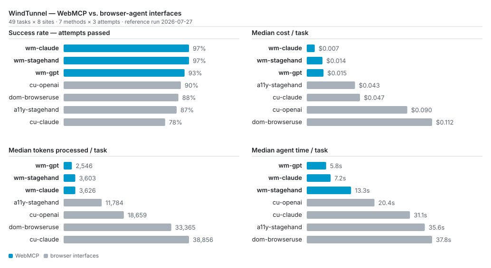

<div align="center">

<picture>
  <source media="(prefers-color-scheme: dark)" srcset="assets/logo-dark.svg">
  
</picture>

# WindTunnel

**Benchmark WebMCP against other methods browser agents use to interact with websites.**

[Quick start](#quick-start) · [Results](results/2026-07-27-reference/) · [Methodology](docs/SPEC.md) · [Cost](#cost) · [WebMCP spec](https://github.com/webmachinelearning/webmcp)

[](LICENSE)
[](tasks/)
[](https://github.com/webmachinelearning/webmcp)
[](https://github.com/nekuda-ai/WindTunnel/actions/workflows/test.yml)
[](results/2026-07-27-reference/)

</div>

**WindTunnel compares WebMCP with other ways browser agents interact with
websites.** It runs the same tasks on the same sites and measures success rate,
execution time, token usage, and cost.

## Quick start

Just want the results? [Open the reference
run.](results/2026-07-27-reference/)

Run the harness for free (Node 20.11+, no key, no Docker):

```bash
npm ci
WT_FAKE_LIFECYCLE=1 npm run bench    # no LLM — scores 0/7 by design, just proves it runs
```

Run the real benchmark — needs Docker, Linux, and a key
([setup](#running-it-yourself)):

```bash
npx playwright install chromium
export ANTHROPIC_API_KEY=sk-ant-...
npm run bench -- --arms wm-claude,cu-claude --budget 2
```

Runs the 7 tasks on the three lightweight sites once each, same model on two
interfaces — WebMCP against screenshots. 14 attempts, well under $1; `--budget`
hard-stops the run if it isn't.

## Background: Three ways to operate a website

A browser agent can operate a website through three main interfaces:

1. **Screenshots (computer use)** — it reads rendered images of the page and
   acts by coordinate.
2. **Page structure** — it reads the page's DOM and accessibility tree.
3. **WebMCP** — the website exposes direct actions (`add_to_cart(id)`,
   `book_slot(time)`) for the agent to call.
   ([What is WebMCP?](https://github.com/webmachinelearning/webmcp))

## Results

**Reference run: 2026-07-27** — 7 methods × 49 tasks across 8 sites × 3
attempts = 1,029 attempts.

WebMCP completes more tasks (96–98% vs 80–90%) while running **~3–4× faster**,
costing **~3–8× less**, and processing **~3–10× fewer tokens**.

**Full run data** — [`results/2026-07-27-reference/`](results/2026-07-27-reference/):
interactive explorer, per-attempt rows, full transcripts, and
[`PROVENANCE.md`](results/2026-07-27-reference/PROVENANCE.md).

Tasks solved per method (majority of 3 attempts):

| Interface | Method | Model | Solved | % |
|---|---|---|---|---|
| WebMCP | wm-claude | claude-sonnet-4-6 | 48/49 | 98% |
| WebMCP | wm-gpt | gpt-5.5 | 47/49 | 96% |
| WebMCP | wm-stagehand | claude-sonnet-4-6 | 47/49 | 96% |
| Screenshots | cu-openai | gpt-5.5 | 44/49 | 90% |
| DOM + vision | dom-browseruse | claude-sonnet-4-6 | 43/49 | 88% |
| Page structure (a11y) | a11y-stagehand | claude-sonnet-4-6 | 42/49 | 86% |
| Screenshots | cu-claude | claude-sonnet-4-6 | 39/49 | 80% |

<picture>
  <source media="(prefers-color-scheme: dark)" srcset="assets/charts/summary-dark.svg">
  
</picture>

<sub>Generated from the reference run's data by `node scripts/readme-charts.mjs`
— one panel per theme, so it reads on a light or dark GitHub.</sub>

### How the advantage scales with journey length

| Tier | Tasks | WebMCP solved | Browser solved | Cheaper | Faster | Lighter |
|---|---:|---:|---:|---:|---:|---:|
| Answer (1–2 steps) | 21 | 62/63 | 79/84 | 5.6× | 3.8× | 6.9× |
| Act, short (3–5) | 16 | 48/48 | 58/64 | 4.9× | 3.5× | 6.1× |
| **Act, long (6–10)** | 8 | **23/24** | **20/32** | **11.2×** | 5.8× | **18.6×** |
| **Transaction (8–15)** | 4 | **9/12** | **11/16** | **12.1×** | 7.0× | **15.3×** |

**On long journeys the gap widens sharply.** Across the 12 long tasks, WebMCP
solved **89%** of cells vs **65%**, at an **order of magnitude lower cost
(9–13×)** and **11–23× fewer tokens**, while running **4–9× faster** — the cost
advantage roughly doubles from short tasks (≈5×) to long ones (≈12×).

<sub>How these numbers are computed: [`docs/SPEC.md`](docs/SPEC.md).</sub>

## How it works

Every task runs on the same site, from the same seeded state, scored by the
same check, for every method — so a difference in outcome isn't the site or the
data. What differs is the whole method configuration: interface, model,
framework, and turn budget.

- **Real, self-hosted applications.** Production open-source apps, not
  synthetic pages. Each runs locally in Docker, pinned to a fixed version.
- **Outcome-based scoring.** No human or model judges a run: WindTunnel
  inspects the resulting application state — is the item in the cart, does the
  appointment exist — and records pass or fail, plus what the attempt cost.
- **Integrity.** Checked values are generated fresh from a seed, state-changing
  tasks are scored by inspecting the application, and every transcript is
  published so any answer can be audited. Memorization risk and its limits:
  [`docs/SPEC.md`](docs/SPEC.md).

## The sites

Every task asks the agent to do one of three actions — a trust ladder taken from
[WebMCP.com methodology](https://webmcp.com/methodology).

- **Answer** — read-only. Search, look up a price, check availability.
- **Act** — change state reversibly. Add to cart, apply a filter, fill a form.
- **Transact** — money or commitment. Checkout, book, order, subscribe. The
  highest bar, where a wrong call has real consequences.

Eight applications across public and authenticated pages and different stacks —
six live targets, two read-only controls.

| Site | Type | Pulled from (upstream) | Exercises |
|---|---|---|---|
| nextjs-starter-medusa | online store | [medusajs/nextjs-starter-medusa](https://github.com/medusajs/nextjs-starter-medusa) | browse → cart → checkout |
| hi-events | events / ticketing | [HiEventsDev/Hi.Events](https://github.com/HiEventsDev/Hi.Events) | browse → ticket checkout |
| easyappointments | appointment booking | [alextselegidis/easyappointments](https://github.com/alextselegidis/easyappointments) | booking; admin (auth) |
| learnhouse | course platform | [learnhouse/learnhouse](https://github.com/learnhouse/learnhouse) | catalog; authoring (auth) |
| idurar-erp-crm | B2B CRM | [idurar/idurar-erp-crm](https://github.com/idurar/idurar-erp-crm) | record CRUD (auth) |
| directory-9d8 | business directory | [9d8dev/directory](https://github.com/9d8dev/directory) | search / filter |
| tailwind-nextjs-blog | blog (control) | [timlrx/tailwind-nextjs-starter-blog](https://github.com/timlrx/tailwind-nextjs-starter-blog) | read-only content |
| bulletproof-react | web app (control) | [alan2207/bulletproof-react](https://github.com/alan2207/bulletproof-react) | read-only; auth |

## The tasks

49 benchmark tasks across the eight sites, plus 10 calibration tasks for cost
measurement. Four difficulty tiers by journey length:

| Tier | Steps | Example |
|---|---|---|
| Answer | 1–2 | "What is the price of X?" |
| Act (short) | 3–5 | "Add two of X to the cart." |
| Act (long) | 6–10 | "File a ticket, assign it, set its priority from the report." |
| Transaction | 8–15 | "Book the cheapest available slot and confirm." |

Each task is attempted N times (3 by default). A task is **solved** when a
majority of attempts pass; the headline is solved ÷ total, reported next to
median time, tokens, and cost.

Each task also carries a per-interface turn budget — a screenshot agent needs
~3 turns per step, a tool-calling agent ~1 (defaults: [`docs/SPEC.md`](docs/SPEC.md)).

## The methods

Seven implementations across the three interfaces, so the comparison doesn't
depend on one framework or model:

| Interface | Implementation | Model |
|---|---|---|
| Screenshots (computer use) | Anthropic computer use | claude-sonnet-4-6 |
| Screenshots (computer use) | OpenAI computer use | gpt-5.5 |
| Page structure + vision | Browser Use (DOM + screenshot) | claude-sonnet-4-6 |
| Page structure | Stagehand (accessibility tree) | claude-sonnet-4-6 |
| WebMCP | native loop | claude-sonnet-4-6 |
| WebMCP | native loop | gpt-5.5 |
| WebMCP | via Stagehand | claude-sonnet-4-6 |

## Cost

**Where the tokens go.** How much an agent reads each turn is set by the
interface:

- **Screenshots (computer use)** — a full page *image* every turn: thousands of
  tokens each, refreshed nearly every step. Heaviest.
- **Page structure (DOM / accessibility tree)** — the page's *text* every turn.
  Lighter than images, but still the whole page, re-read each step.
- **WebMCP** — a short list of tool schemas plus small JSON results. No page
  text, no screenshots. Lightest by far.

**Task length multiplies it.** Page-reading interfaces grow fastest because
they re-read the page each step — from the shortest tier to the longest their
cost grows ~7×, against ~3× for WebMCP.

**Per-task medians** from the reference run (tokens include cache reads;
pricing detail in [`docs/SPEC.md`](docs/SPEC.md)):

| Interface | Methods | Tokens processed / task | $ / task (median) |
|---|---|---:|---:|
| WebMCP | `wm-claude` / `wm-gpt` / `wm-stagehand` | ~3,400 | ~$0.013 |
| Page structure · a11y | `a11y-stagehand` | ~11,800 | ~$0.043 |
| Screenshots | `cu-claude` / `cu-openai` | ~25,800 | ~$0.068 |
| DOM + vision | `dom-browseruse` | ~33,400 | ~$0.112 |

**What a whole run costs**, with all seven methods:

| Run | Scope | Ballpark |
|---|---|---:|
| quick check | `--preset smoke --sites lite` — 3 light sites, 1 attempt each | under $1 |
| small | `--preset lite --sites lite` — the lite task set × 3 attempts | $5–10 |
| full reference (measured) | all 8 sites, 49 tasks × 3 attempts × all 7 methods | ~$107 |

The three WebMCP methods were ~9% of that bill; full breakdown:
[docs/CALIBRATION.md](docs/CALIBRATION.md).

**Spending less.** The levers, cheapest first:

- **Fewer sites** — `--sites lite` (3 lightweight sites, no databases).
- **Fewer / cheaper methods** — the WebMCP and Stagehand-a11y arms are
  ~$0.01/task; the computer-use and Browser-Use arms carry most of the cost.
- **Fewer attempts** — `--preset smoke` or `--n 1` instead of the default 3
  (you lose majority voting, so one run decides each task).

## Running it yourself

**Setup.** You need Docker, Node 20.11+, and an API key for the model under test:

```bash
npm install
npx playwright install chromium                       # browser for the agents (or set WT_CHROME)
python3 -m venv .venv-browseruse \
  && .venv-browseruse/bin/pip install browser-use==0.12.7   # only for the dom-browseruse method
```

Real site boots use the in-repo capsule tooling, which is **Linux-only**. On
macOS you can still dry-run the pipeline (`WT_FAKE_LIFECYCLE=1`) or point a run
at a site you booted yourself (`WT_MANUAL_BASEURL=http://localhost:PORT`).

**Site profiles** size the run to the machine at hand:

| profile | sites | needs | runs on |
|---|---|---|---|
| `lite` | 3 lightweight sites, no databases | Node | laptop, CI |
| `core` | `lite` + the online store | + Postgres | 8 GB laptop |
| `categories` | one site per category | mixed | 16 GB machine |
| `full` | all 8 sites | all stacks | 16 GB+ worker |

**Commands.** `--arms` picks the methods; the default (`scripted`) is a free,
no-LLM baseline that only exercises the pipeline:

```bash
npm run bench -- --preset smoke --sites lite --arms scripted    # free pipeline check, no API key
npm run bench -- --preset smoke --sites lite --arms wm-claude,cu-claude   # cheapest paid run, 1 attempt per task
npm run bench -- --preset lite --sites lite --arms wm-claude,cu-claude,dom-browseruse,a11y-stagehand   # every task on the three lite sites × 3 attempts
npm run bench -- --preset smoke --sites lite --arms wm-claude --seed 7 --budget 2 --label check
```

**Keys.** Runs read the provider key straight from your environment:

```bash
export ANTHROPIC_API_KEY=sk-ant-...   # cu-claude, dom-browseruse, a11y-stagehand, wm-claude, wm-stagehand
export OPENAI_API_KEY=sk-...          # cu-openai, wm-gpt
export WT_SECRET=...                  # optional capsule secret
export WT_SECRET_KEY=...              # optional key used to protect it
```

A method whose key is absent is skipped with a notice, never an error — with
only an Anthropic key you get those five methods and the two GPT ones are
skipped; with only an OpenAI key, the reverse.

**Switching models.** `--model <method>=<model>` overrides the model for one
method:

```bash
npm run bench -- --preset lite --sites lite --arms wm-claude --model wm-claude=claude-opus-4-8
```

Computer use needs a computer-use-capable model. Switching provider takes that
provider's own method and key, not just a model name.

## Repo layout

```
docs/       design spec and methodology
sites/      sites under test + subset configuration
capsules/   self-contained boot recipes per site (Docker, pinned commits, WebMCP tools)
fixtures/   per-site seed data and runtime patches
goldens/    the reference WebMCP tool implementations, one patch per site
tasks/      task definitions
harness/    the runner (bin/ has the site-boot CLIs)
scoring/    per-task checks and result formats
arms/       interface implementations
results/    finished runs and reports
tests/      harness test suite (npm test)
```

## License

WindTunnel's own code — harness, boot recipes, and WebMCP patches — is
Apache-2.0. It does **not** vendor any site's source tree: each site is cloned
from its upstream at a pinned commit and patched locally at run time, so the
copyleft (AGPL/GPL) sites run locally only, and Hi.Events' required "Powered by
Hi.Events" footer is preserved. A few reference patches modify upstream files;
the upstream lines those hunks carry remain under the upstream project's
license. Upstreams, licenses, and pinned commits:
[`ATTRIBUTION.md`](ATTRIBUTION.md) (canonical) and each `capsules/<site>/capsule.yaml`.
