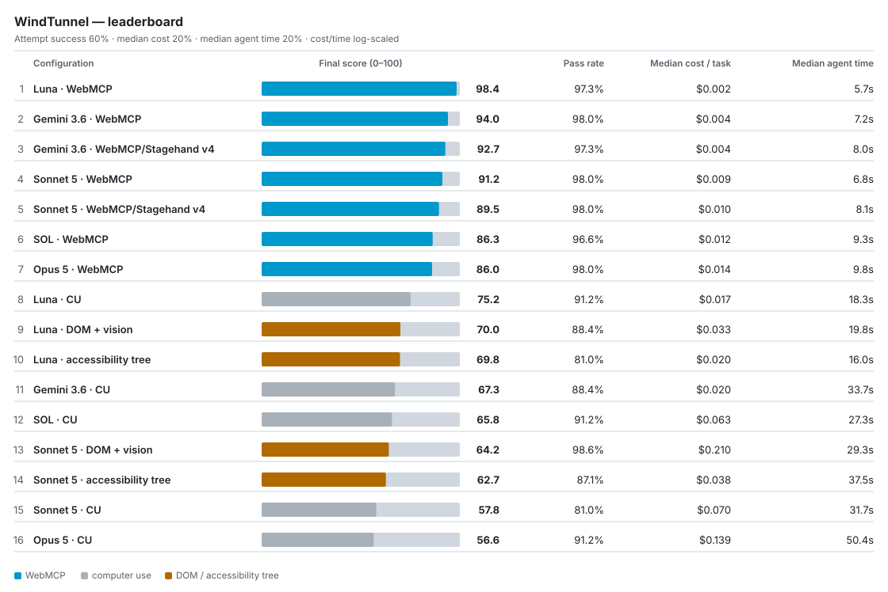

<div align="center">

<picture>
  <source media="(prefers-color-scheme: dark)" srcset="assets/logo-dark.svg">
  
</picture>

# WindTunnel

**Benchmark WebMCP against other methods browser agents use to interact with websites.**

**WebMCP delivers up to 5.5× faster execution, 23× lower cost, and 12.5× fewer tokens—while solving 98% of tasks.**

[Quick start](#quick-start) · [Results](#results) · [Run data](results/) · [Methodology](docs/SPEC.md) · [Cost](#cost) · [WebMCP spec](https://github.com/webmachinelearning/webmcp)

[](LICENSE)
[](tasks/)
[](https://github.com/webmachinelearning/webmcp)
[](https://github.com/nekuda-ai/WindTunnel/actions/workflows/test.yml)
[](#results)

</div>

**WindTunnel compares WebMCP with other ways browser agents interact with
websites.** It runs the same tasks on the same sites and measures success rate,
execution time, token usage, and cost.

## Quick start

Just want the results? [Jump to them.](#results)

Run the harness for free (Node 20.11+, no key, no Docker):

```bash
npm ci
WT_FAKE_LIFECYCLE=1 npm run bench    # no LLM — scores 0/7 by design, just proves it runs
```

Run the real benchmark — needs Docker, Linux, and a key
([setup](#running-it-yourself)):

```bash
npx playwright install chromium
export ANTHROPIC_API_KEY=sk-ant-...
npm run bench -- --arms wm-claude,cu-claude --budget 2
```

Runs the 7 tasks on the three lightweight sites once each, same model on two
interfaces — WebMCP against screenshots. 14 attempts, well under $1; `--budget`
hard-stops the run if it isn't.

## Background: Three ways to operate a website

A browser agent can operate a website through three main interfaces:

1. **Screenshots (computer use)** — it reads rendered images of the page and
   acts by coordinate.
2. **Page structure** — it reads the page's DOM and accessibility tree.
3. **WebMCP** — the website exposes direct actions (`add_to_cart(id)`,
   `book_slot(time)`) for the agent to call.
   ([What is WebMCP?](https://github.com/webmachinelearning/webmcp))

## Results

**Canonical run: 2026-08-20** — 16 configurations × 49 tasks across 8 sites ×
3 attempts = **2,352 attempt rows** and **784 majority verdicts**, with a 600s
per-attempt cap.

**Eight configurations tie at 48/49 tasks solved:** all seven WebMCP
configurations and Sonnet 5 on DOM + vision. Raw task-solve rate therefore does
not separate WebMCP from the best screen-driving configuration.

**Sonnet 5 on DOM + vision has the highest attempt success on the board:
145/147 (98.6%).** For the same model, those attempts cost **$49.87 total vs.
$1.48** for native WebMCP (33.6×), while median agent time was **29.3s vs.
6.8s**.

<picture>
  <source media="(prefers-color-scheme: dark)" srcset="assets/charts/balanced-leaderboard-dark.svg">
  
</picture>

<sub>Regenerate with `node scripts/readme-charts.mjs` — it reads `results/canonical` and fails if any label would overflow its column.</sub>

Canonical artifacts — [CSV](results/canonical/results.csv),
[run JSON](results/canonical/run.json),
[provenance](results/canonical/PROVENANCE.md), and
[interactive explorer](results/canonical/explorer.html).

| Configuration | Interface | Solved | Attempts | Turn-cap | Median cost | Median tokens | Median s |
|---|---|---:|---:|---:|---:|---:|---:|
| GPT-5.6 Luna · native | WebMCP | 48/49 | 143/147 | 0 | $0.002 | 2,596 | 5.7 |
| Gemini 3.6 Flash · native | WebMCP | 48/49 | 144/147 | 0 | $0.004 | 4,453 | 7.2 |
| Gemini 3.6 Flash · Stagehand v4 | WebMCP | 48/49 | 143/147 | 0 | $0.004 | 4,371 | 8.0 |
| Sonnet 5 · native | WebMCP | 48/49 | 144/147 | 0 | $0.009 | 5,172 | 6.8 |
| Sonnet 5 · Stagehand v4 | WebMCP | 48/49 | 144/147 | 0 | $0.010 | 5,161 | 8.1 |
| GPT-5.6 SOL · native | WebMCP | 48/49 | 142/147 | 0 | $0.012 | 2,573 | 9.3 |
| Claude Opus 5 · native | WebMCP | 48/49 | 144/147 | 0 | $0.014 | 4,770 | 9.8 |
| Sonnet 5 | DOM + vision | 48/49 | 145/147 | 1 | $0.210 | 64,424 | 29.3 |
| GPT-5.6 SOL | computer use | 46/49 | 134/147 | 12 | $0.063 | 16,235 | 27.3 |
| GPT-5.6 Luna | computer use | 45/49 | 134/147 | 11 | $0.017 | 20,914 | 18.3 |
| Claude Opus 5 | computer use | 45/49 | 134/147 | 27 | $0.139 | 47,141 | 50.4 |
| Gemini 3.6 Flash | computer use | 43/49 | 130/147 | 22 | $0.020 | 23,857 | 33.7 |
| GPT-5.6 Luna | DOM + vision | 43/49 | 130/147 | 0 | $0.033 | 29,561 | 19.8 |
| Sonnet 5 | a11y tree | 42/49 | 128/147 | 29 | $0.038 | 10,762 | 37.5 |
| GPT-5.6 Luna | a11y tree | 40/49 | 119/147 | 38 | $0.020 | 18,517 | 16.0 |
| Sonnet 5 | computer use | 39/49 | 119/147 | 41 | $0.070 | 57,701 | 31.7 |

<sub>Attempts are successful attempts out of 147; Turn-cap counts attempts
that exhausted their model-turn budget. Median tokens are total processed:
uncached input + cache reads + cache writes + output. The table reports tasks
solved by a majority of three attempts; infrastructure rows are excluded.</sub>

<sub>The headline multiples are maximum same-model ratios: Sonnet 5 on the
a11y tree vs. native WebMCP for time (37.5s / 6.8s), and Sonnet 5 on DOM +
vision vs. native WebMCP for cost ($0.210 / $0.009) and tokens (64,424 /
5,172).</sub>

**Turn budgets are a material separator.** None of the **1,029 WebMCP
attempts** hit the turn budget, versus **181 of 1,323 screen-driving attempts**.
Matched like-for-like — each model's native WebMCP run against its own
computer-use run, 735 attempts per side — the count is **0 vs. 113**. The
screen-driving arms are given roughly 3× larger budgets because a screenshot
agent needs about three model turns per journey step.

**Model snapshot reporting has a harness limitation.** Stagehand and
browser-use cannot report the exact model snapshot they were served, so those
rows use `snapshot_source: unavailable:<harness>`. The configured model is
confirmed out of band with [`scripts/verify-model.mjs`](scripts/verify-model.mjs).

### How the advantage scales with journey length

| Tier | Tasks | WebMCP solved | Computer use solved | Cheaper | Faster | Lighter |
|---|---:|---:|---:|---:|---:|---:|
| Answer (1–2 steps) | 21 | 105/105 | 88/105 | 6.7× | 3.7× | 7.1× |
| Action, short (3–5) | 16 | 80/80 | 73/80 | 5.2× | 3.1× | 4.7× |
| **Action, long (6–10)** | 8 | **40/40** | **39/40** | **9.6×** | **5.4×** | **11.1×** |
| **Sensitive action (8–15)** | 4 | **15/20** | **18/20** | **10.4×** | **8.9×** | **18.9×** |

**On long journeys the efficiency gap still widens sharply, but not the solve
rate.** Across the 12 long and sensitive-action tasks, computer use solved
**57/60 model-task cells (95%)** vs. WebMCP's **55/60 (92%)**. WebMCP used
**11.2× lower cost**, **5.7× less agent time**, and **13.3× fewer tokens**. The
sensitive-action row is the deliberate coverage boundary:
today's WebMCP tools hand guest checkout back to the page before the final
purchase, so computer use completes that one task more often.

<sub>How these numbers are computed: [`docs/SPEC.md`](docs/SPEC.md).</sub>

## How it works

Every task runs on the same site, from the same seeded state, scored by the
same check, for every method — so a difference in outcome isn't the site or the
data. What differs is the whole method configuration: interface, model,
framework, and turn budget.

- **Real, self-hosted applications.** Production open-source apps, not
  synthetic pages. Each runs locally in Docker, pinned to a fixed version.
- **Outcome-based scoring.** No human or model judges a run: WindTunnel
  inspects the resulting application state — is the item in the cart, does the
  appointment exist — and records pass or fail, plus what the attempt cost.
- **Integrity.** Checked values are generated fresh from a seed, state-changing
  tasks are scored by inspecting the application, and every transcript is
  published so any answer can be audited. Memorization risk and its limits:
  [`docs/SPEC.md`](docs/SPEC.md).
- **Scorer correction.** Independent review found that the canonical merge had
  been built before corrected predicates were applied. Re-scoring fixed 19
  false negatives — 19 promotions and 0 demotions — and the corrected rows are
  marked in the canonical CSV.

## The sites

Eight applications across public and authenticated pages and different stacks —
six live targets, two read-only controls.

| Site | Type | Pulled from (upstream) | Exercises |
|---|---|---|---|
| nextjs-starter-medusa | online store | [medusajs/nextjs-starter-medusa](https://github.com/medusajs/nextjs-starter-medusa) | browse → cart → checkout |
| hi-events | events / ticketing | [HiEventsDev/Hi.Events](https://github.com/HiEventsDev/Hi.Events) | browse → ticket checkout |
| easyappointments | appointment booking | [alextselegidis/easyappointments](https://github.com/alextselegidis/easyappointments) | booking; admin (auth) |
| learnhouse | course platform | [learnhouse/learnhouse](https://github.com/learnhouse/learnhouse) | catalog; authoring (auth) |
| idurar-erp-crm | B2B CRM | [idurar/idurar-erp-crm](https://github.com/idurar/idurar-erp-crm) | record CRUD (auth) |
| directory-9d8 | business directory | [9d8dev/directory](https://github.com/9d8dev/directory) | search / filter |
| tailwind-nextjs-blog | blog (control) | [timlrx/tailwind-nextjs-starter-blog](https://github.com/timlrx/tailwind-nextjs-starter-blog) | read-only content |
| bulletproof-react | web app (control) | [alan2207/bulletproof-react](https://github.com/alan2207/bulletproof-react) | read-only; auth |

## The tasks

49 benchmark tasks across the eight sites, plus 10 calibration tasks for cost
measurement. Four difficulty tiers by journey length:

| Tier | Steps | Example |
|---|---|---|
| Answer | 1–2 | "What is the price of X?" |
| Action (short) | 3–5 | "Add two of X to the cart." |
| Action (long) | 6–10 | "File a ticket, assign it, set its priority from the report." |
| Sensitive action | 8–15 | "Book the cheapest available slot and confirm." |

Each task is attempted N times (3 by default). A task is **solved** when a
majority of attempts pass; the headline is solved ÷ total, reported next to
median time, tokens, and cost.

Each task also carries a per-interface turn budget — a screenshot agent needs
~3 turns per step, a tool-calling agent ~1 (defaults: [`docs/SPEC.md`](docs/SPEC.md)).

## The methods

The canonical benchmark spans 10 implementations and 16 model-interface
configurations across Sonnet 5, Opus 5, GPT-5.6 Luna, GPT-5.6 SOL, and Gemini
3.6 Flash. Seven configurations use WebMCP and nine use screen-driving
interfaces. Every configuration uses the same 49 tasks, sites, scoring, and
three attempts.

## Cost

**Where the tokens go.** How much an agent reads each turn is set by the
interface:

- **Screenshots (computer use)** — a full page *image* every turn: thousands of
  tokens each, refreshed nearly every step. Heaviest.
- **Page structure (DOM / accessibility tree)** — the page's *text* every turn.
  Lighter than images, but still the whole page, re-read each step.
- **WebMCP** — a short list of tool schemas plus small JSON results. No page
  text, no screenshots. Lightest by far.

**Task length multiplies it.** Page-reading interfaces grow fastest because
they re-read the page each step. Across the native model pairs, WebMCP's median
cost advantage grows from about 5× on short tasks to 11–12× on longer journeys.

**Per-task medians** across the current 16-configuration leaderboard (tokens
include cache reads and cache writes; pricing detail in
[`docs/SPEC.md`](docs/SPEC.md)):

| Interface | Configurations | Median tokens / task | Median cost / task |
|---|---:|---:|---:|
| WebMCP | 7 | 2,573–5,172 | $0.002–$0.014 |
| Computer use | 5 | 16,235–57,701 | $0.017–$0.139 |
| Accessibility tree | 2 | 10,762–18,517 | $0.020–$0.038 |
| DOM + vision | 2 | 29,561–64,424 | $0.033–$0.210 |

**PROJECTED cost per 1,000 task attempts** — extrapolated from the 147 observed
attempts in each configuration, not an observed 1,000-run experiment:

| Interface | Range | Median |
|---|---:|---:|
| WebMCP | $2.77–$20.43 | $10.10 |
| Screen-driving | $35.05–$339.24 | $118.68 |

The projected ranges do not overlap.

**What a run costs:**

| Run | Scope | Ballpark |
|---|---|---:|
| quick check | `--preset smoke --sites lite` — 3 light sites, 1 attempt each | under $1 |
| small | `--preset lite --sites lite` — the lite task set × 3 attempts | $5–10 |
| full paired model (measured additions) | all 8 sites, 49 tasks × 3 attempts × WebMCP + computer use | ~$6–35 |
| full canonical leaderboard (measured) | all 8 sites, 49 tasks × 3 attempts × 16 configurations | $175.62 |

In the former 2026-07-27 reference flight, the three WebMCP methods were ~9%
of the bill; historical breakdown:
[docs/CALIBRATION.md](docs/CALIBRATION.md).

**Spending less.** The levers, cheapest first:

- **Fewer sites** — `--sites lite` (3 lightweight sites, no databases).
- **Fewer / cheaper methods** — WebMCP medians are $0.002–$0.014/task;
  computer use and DOM + vision carry most of the cost.
- **Fewer attempts** — `--preset smoke` or `--n 1` instead of the default 3
  (you lose majority voting, so one run decides each task).

## Running it yourself

**Setup.** You need Docker, Node 20.11+, and an API key for the model under test:

```bash
npm install
npx playwright install chromium                       # browser for the agents (or set WT_CHROME)
python3 -m venv .venv-browseruse \
  && .venv-browseruse/bin/pip install browser-use==0.12.7   # only for the dom-browseruse method
```

Real site boots use Linux-oriented capsule tooling. Native Linux is the
lowest-overhead host; macOS works through Docker Desktop when GNU tar and
coreutils are installed and placed first on `PATH` (`brew install gnu-tar
coreutils`). Docker Desktop's VM and filesystem layer add boot/reset and
wall-clock overhead, so report the host and avoid comparing absolute latency
with bare-metal Linux. You can also dry-run the pipeline
(`WT_FAKE_LIFECYCLE=1`) or point it at a site you booted yourself
(`WT_MANUAL_BASEURL=http://localhost:PORT`).

**Site profiles** size the run to the machine at hand:

| profile | sites | needs | runs on |
|---|---|---|---|
| `lite` | 3 lightweight sites, no databases | Node | laptop, CI |
| `core` | `lite` + the online store | + Postgres | 8 GB laptop |
| `categories` | one site per category | mixed | 16 GB machine |
| `full` | all 8 sites | all stacks | 16 GB+ worker |

**Commands.** `--arms` picks the methods; the default (`scripted`) is a free,
no-LLM baseline that only exercises the pipeline:

```bash
npm run bench -- --preset smoke --sites lite --arms scripted    # free pipeline check, no API key
npm run bench -- --preset smoke --sites lite --arms wm-claude,cu-claude   # cheapest paid run, 1 attempt per task
npm run bench -- --preset lite --sites lite --arms wm-claude,cu-claude,dom-browseruse,a11y-stagehand   # every task on the three lite sites × 3 attempts
npm run bench -- --preset smoke --sites lite --arms wm-claude --seed 7 --budget 2 --label check
npm run bench -- --preset smoke --sites idurar-erp-crm --arms cu-openai --task-ids id-6,id-6,id-8 --n 1
```

**Keys.** Runs read the provider key straight from your environment:

```bash
export ANTHROPIC_API_KEY=sk-ant-...   # cu-claude, dom-browseruse, a11y-stagehand, wm-claude, wm-stagehand
export OPENAI_API_KEY=sk-...          # cu-openai, wm-gpt
export GEMINI_API_KEY=...             # cu-gemini, wm-gemini
export WT_SECRET=...                  # optional capsule secret
export WT_SECRET_KEY=...              # optional key used to protect it
```

A method whose key is absent is skipped with a notice, never an error.
`--task-ids` selects exact task IDs; repeated IDs intentionally repeat a task,
which is useful for targeted diagnostics.

**Switching models.** `--model <method>=<model>` overrides the model for one
method:

```bash
npm run bench -- --preset lite --sites lite --arms wm-claude --model wm-claude=claude-opus-5
```

Computer use needs a computer-use-capable model. Switching provider takes that
provider's own method and key, not just a model name.

## Repo layout

```
docs/       design spec and methodology
sites/      sites under test + subset configuration
capsules/   self-contained boot recipes per site (Docker, pinned commits, WebMCP tools)
fixtures/   per-site seed data and runtime patches
goldens/    the reference WebMCP tool implementations, one patch per site
tasks/      task definitions
harness/    the runner (bin/ has the site-boot CLIs)
scoring/    per-task checks and result formats
arms/       interface implementations
results/    finished runs and reports
tests/      harness test suite (npm test)
```

## License

WindTunnel's own code — harness, boot recipes, and WebMCP patches — is
Apache-2.0. It does **not** vendor any site's source tree: each site is cloned
from its upstream at a pinned commit and patched locally at run time, so the
copyleft (AGPL/GPL) sites run locally only, and Hi.Events' required "Powered by
Hi.Events" footer is preserved. A few reference patches modify upstream files;
the upstream lines those hunks carry remain under the upstream project's
license. Upstreams, licenses, and pinned commits:
[`ATTRIBUTION.md`](ATTRIBUTION.md) (canonical) and each `capsules/<site>/capsule.yaml`.
